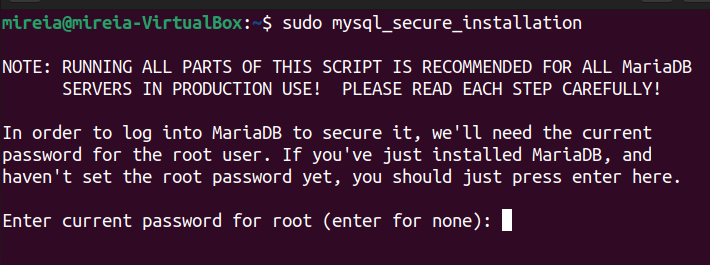
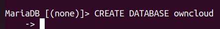
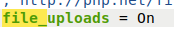

# Instalació de Owncloud en Linux

## Índex

* Instal·lació de Apache
* Instal·lació MariaDB
* Creacio de base de dades
* Instal·lació de PHP i els moduls necesaris
* Instal·lació de Ownclaud

### Instalacio de Apache

Per a instal·lar Apache a l'Ubuntu haurem d'usar la següent comanda

`sudo apt install apache2`

Després haurem de desactivar el llistat de directoris del servidor

`sudo sed -i "s/Options Indexes FollowSymLinks/Options FollowSymLinks/" /etc/apache2/apache2.conf`

### Instal·lació MariaDB

Per a instal·lar el MariaDB haurem d'usar la següent comanda

`sudo apt-get install mariadb-server mariadb-client -y`

Després d'instal·lar MariaDB haurem de configurar-la

`sudo mysql_secure_installation`

El primer que ens demanarà serà posar una contrasenya per a l'usuari "root" en el posaré "Admin2022@"
i ens preguntarà si volem canviar el socket d'autentificació pressionem enter, ja que és l'opcio predeterminada i li donem que sí també a canviar la contrasenya de root

Ens preguntarà altres cises com si volem esborrar els usuaris anònims o si volem desactivar que puguin entrar en mode root de forma remota polsarem enter a tot menys al dubte del root que donarem no.

I per últim reiniciem el MariaDB

`sudo systemctl restart mariadb.service` o també podem usar `sudo service mariadb.service restart`

### Creacio de base de dades

El primer a fer és entrar a MariaDB i després crear la base de dades amb les següents comandes

`sudo mysql -u root -p`

`CREATE DATABASE owncloud;`

Després crearem un usuari que és dirà "ownclouduser" i la seva contrasenya serà "Admin2022@"

`CREATE USER 'ownclouduser'@'localhost' IDENTIFIED BY 'Admin2022@';`

Li haurem de donar accés a la base de dades a l'usuari que acabem de crear

`GRANT ALL ON owncloud.* TO 'ownclouduser'@'localhost' IDENTIFIED BY 'Admin2022@' WITH GRANT OPTION;`

Per últim aplicarem els canvis i sortirem

`FLUSH PRIVILEGES;`
`EXIT;`

### Instal·lació de PHP i els moduls necesaris

Hem s'instal·la el PHP usan les següents comandes

`sudo apt-get install software-properties-common -y`
`sudo add-apt-repository ppa:ondrej/php`

Després haurem d'actualitzar el repositori

`sudo apt update`

Ara instal·larem el PHP i els seus mòduls

`sudo apt install php7.4 libapache2-mod-php7.4 php7.4-common php7.4-mbstring php7.4-xmlrpc php7.4-soap php7.4-apcu php7.4-smbclient php7.4-ldap php7.4-redis php7.4-gd php7.4-xml php7.4-intl php7.4-json php7.4-imagick php7.4-mysql php7.4-cli php7.4-mcrypt php7.4-ldap php7.4-zip php7.4-curl -y`

Després de la instal·lació tocaria editar el fitxer php.ini

`sudo gedit /etc/php/7.4/apach2/php.ini`

